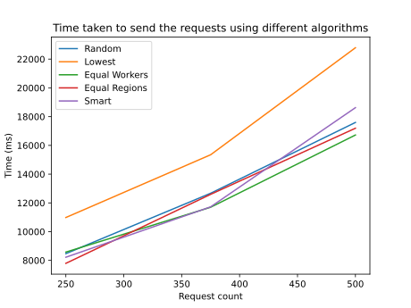

# Load balancer ([Performance Evaluation Assignement](https://ocw.cs.pub.ro/courses/ep/teme/01))

## Student info

- Name: Grama Nicolae
- Group: 342C5
- Completed parts: All
- Expected grade: 11

## System limits analysis

### Requests by a single machine

Considering the fact that heroku has a 30 second maximum response time, I considered the maximum response time for the application to be 25 seconds. I managed to run 500 concurrent requests any of the workers, while mantaining the 25 second threshold (~19 seconds, random workers). More than 500 asynchronous request made the forwarder to crash (I think it had something to do with my small RAM).

### Region latency

I computed the latency by doing ten requests to each of the regions, and the results were:

- emea - 325-375ms
- asia - 535-600ms
- us - 350-430ms

### Computation time

The average computation time is __20ms__, with no difference between the machines.

### Response time

The response time is latency - work_time, which result in the following numbers:

- asia 0 - 520-570ms
- asia 1 - 515-580ms
- emea 0 - 305-355ms
- us 0 - 350-385ms
- us 1 - 330-410ms

### Forwarding unit latency

By directly accessing the workers, all of them had a latency of around 80ms. Because the response times vary, and because all the workers are deployed on the european cluster, it means that the forwarding unit adds a latency based on the region:

- emea >245ms
- asia >455ms
- us >270ms

### Forward unit bottlenecking

This should depend on the machine that runs the forwarding unit (and it's implementation). A bad network could be a point of failure. Considering a very large bandwidth, another possible problem could be the lack of processing power, as the forwarder needs to do a lot of I/O operations, asynchronously. If the number of requests is too large, the latencies produced by the forwarding unit could be larger than the ones intended (described in the previous test).

One possible solution would be to distribute the load, with another load balancer and multiple servers that will handle the task.

### Heroku latency

Looking at the logs produced for each request (on the heroku worker), I added the connect and service times for multiple requests, and in average, I got a latency of about 25ms.

### Architecture design downsides

In my opinion, one very big problem with the current architecture is the fact that all the workers sleep after a timeout. At least one of them should stay always online, to reduce downtime.

Another problem could come from the heroku architecture itself:

- maximum response time of 30 seconds (too small for intensive operations)
- adds latency because of it's proxies, buffers and other systems
- cannot handle too many requests at the same time (mostly because of the worker's tier, being limited to 1 CPU core)

## Implementation

When the load balancer is started, it will make sure that all the workers are up (by sending 1 request to each one, sequencially). After that, based on the specified algorithm (`algorithmSmart` if none is selected), it will send the requests to the necessary workers (asynchronously, to actually simulate a load on the servers). The following algorithms are implemented:

1. `algorithmRandom` - Sends all the requests to random workers
2. `algorithmLowest` - Send all requests to the lowest latency worker
3. `algorithmEqualWorkers` - Splits the requests equally between all the workers
4. `algorithmEqualRegions` - Splits the requests equally between all the regions, but using random workers from that region
5. `algorithmSmart` - Splits the requests between the workers, based on their latency. For example, if the 2nd worker is 3 times faster than the first one, and the 3rd is 2 times slower, for each request sent to the 3rd, 2 are sent to the 1st and 6 to the 2nd.

## Usage

The application can be run using the following command:

`python balancer.py <NO_OF_REQS> <ALGORITHM?>`

To run the application in a docker container, you can use the "command_scripts" to build and load the docker image, and to run the app:

`docker run gramanicu-load-balancer <NO_OF_REQS> <ALGORITHM?>`

## Load balancing algorithms comparison

I measured the performance for 250, 375 and 500 requests, for each of the algorithms (these are results of 1 test).

One thing that is evident is the fact that the "Lowest" algorithm is by far the slowest, as the requests are not split at all (and the latency difference between the workers is not that big).

The other ones have similar performance. The best results were obtained using the "Equal Workers" algorithm, as the latency differences were small and the
number of request is not huge. It's benefits (comparet to "Equal Regions") can be seen when the number of requests increases.

The "Smart" algorithm is slower most likely because it adds some overhead, computing the weights needed for each worker.

Sometimes, the random algorithm had the best performances, as it happened to send requests to workers that were not under load. By decreasing the number of requests, the chance of picking the right workers increased.
